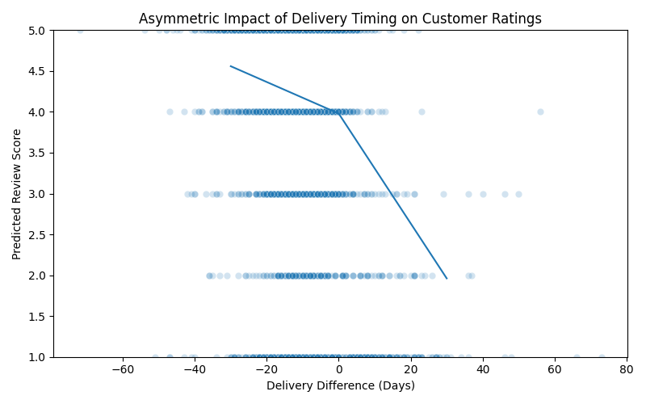

# Asymmetric Impact of Delivery Delays on Customer Ratings
**Evidence of Loss Aversion in E-commerce**  

**1. Business Problem**  

In logistics operations, delivering before the estimated date is often considered a competitive advantage.  
But does it actually compensate for delays?  

**2. Main question:**  

Do delivery delays hurt customer ratings more than early deliveries improve them?  
If the negative impact of delays is stronger than the positive effect of early deliveries, then operational   
focus should prioritize reducing delays rather than accelerating shipments.  

**3. Dataset**  

**Source:** Public [Olist E-commerce Dataset](https://www.kaggle.com/datasets/olistbr/brazilian-ecommerce) (Brazil)  

**Analyzed data:**

- ~96,000 delivered orders
- Difference between actual delivery date and estimated delivery date
- Customer review score (1 to 5 scale)

**Main variable created:**

```python
days_diff = actual_delivery_date - estimated_delivery_date
```  

•	Positive values → Delay  
•	Negative values → Early delivery

**4. Methodology**  

The analysis was conducted in four steps:  

**- Data Extraction (SQL):**  

Data was extracted from a relational SQLite database using SQL joins between:  
•	orders  
•	order_reviews  

Filters were applied to:  
•	Include only delivered orders  
•	Exclude missing delivery dates  

**- Pearson Correlation**  

To identify the linear relationship between delivery timing and review score.  

**- Linear Regression (Baseline Model)**  

To estimate the average impact of delivery timing on customer ratings.  

**- Piecewise Linear Regression (Asymmetric Model)**  

To test whether delays and early deliveries have different effects, two variables were created:  
•	late_days → days of delay (≥ 0)  
•	early_days → days of early delivery (≤ 0)  

Model specification:  
```
Review = β0 ​+ β1​LateDays + β2​EarlyDays
```

This structure allows different slopes on each side of zero, capturing potential asymmetry.  

**5. Key Results**  

- Impact per Day:  
  •	Each additional day of delay reduces the rating by 0.067 points  
  •	Each day of early delivery increases the rating by only 0.019 points

- Asymmetry:  
  •	The negative impact of delays is approximately:  
  •	3.5 times stronger than the positive impact of early delivery.

- Statistical Significance:  
•	p-value < 0.001  
•	R² ≈ 0.088  
•	~96,000 observations

Results are highly statistically significant and economically meaningful.

**6. Business Insight**  

Customers penalize delays much more strongly than they reward early deliveries.  

Strategic implications:  
•	Reducing delays should be prioritized over accelerating deliveries  
•	Small improvements in on-time performance can generate meaningful reputation gains  
•	The behavioral cost of a delay is larger than the benefit of a positive surprise  
This pattern is consistent with behavioral economics principles such as **loss aversion**, where negative experiences   
weigh more heavily than positive ones.  

**7.  Visualization**  
  

The visualization clearly shows:  
•	A steep decline in ratings for delays  
•	A mild increase in ratings for early deliveries  
•	A structural break at zero  

**8.  Tools & Technologies**  

•	SQL (SQLite)  
•	Python  
•	Pandas  
•	Statsmodels  
•	Seaborn  

**9. Conclusion**

This project demonstrates the ability to:  

• Translate a business question into a structured data problem  
• Engineer asymmetric features to capture non-linear effects  
• Apply and interpret econometric modeling  
• Convert statistical results into business insight  


  


